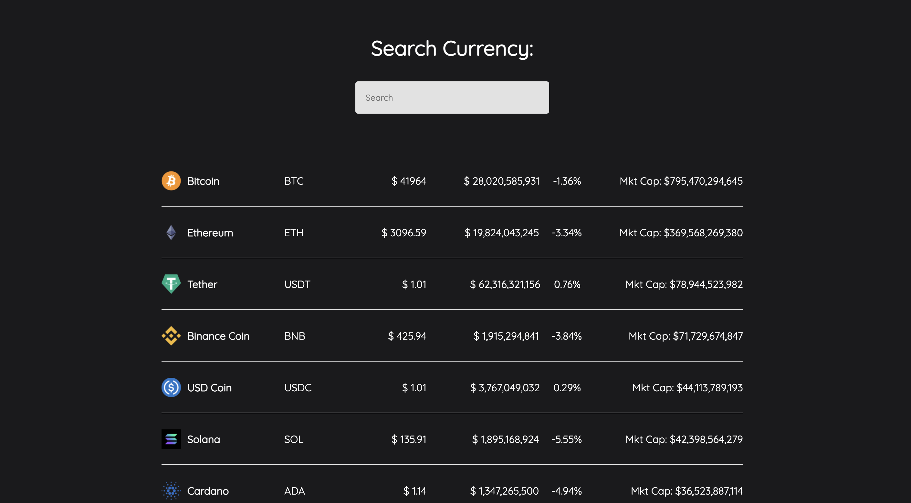
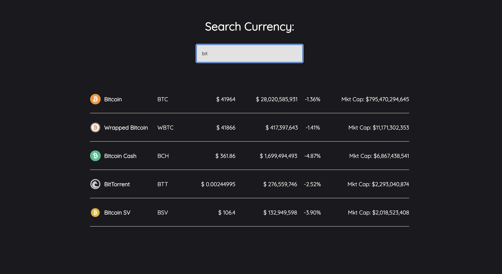

# Cryptocurrency Tracking App

 

## Background:
Built a simple Cryptocurrency tracking app to practice using API's and keep up my skills

1.  As you arrive on the home page it'll show all a list of 100 cryptocurrencies.  The details are displayed next to it's name and you can also search for a particular currency.  As you type in the currency, the page will load as you type.
    &nbsp; &nbsp; 

## What I Used:
- React
- CSS
- [Coingecko](https://www.coingecko.com/en)
- JavaScript